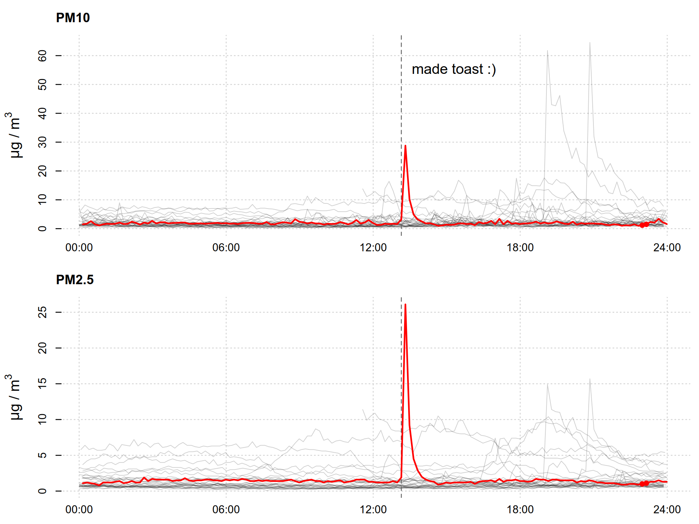

These are the R scrips I use to track particulate matter levels in my apartment with an SDS011 sensor attached to a Raspberry Pi. The main scripts are `serial_connection_continuous.R` which runs/logs data on the Pi, and `read_plot.R` which adds the data to an archive and plots it, emphasizing the observation from the last 24h.

It's pure R, using only `data.table` for data manipulation and `serial` to talk to the sensor. Base graphics for the plot. 

